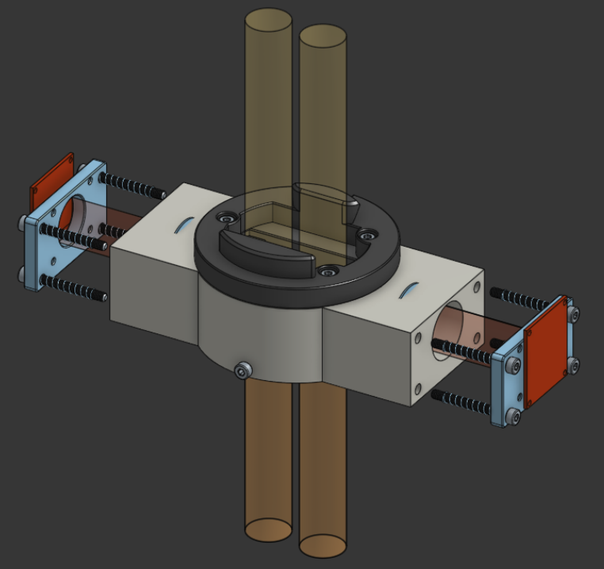
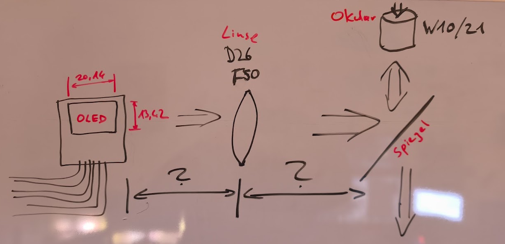
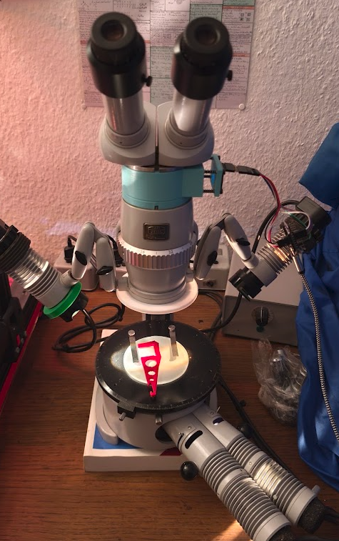
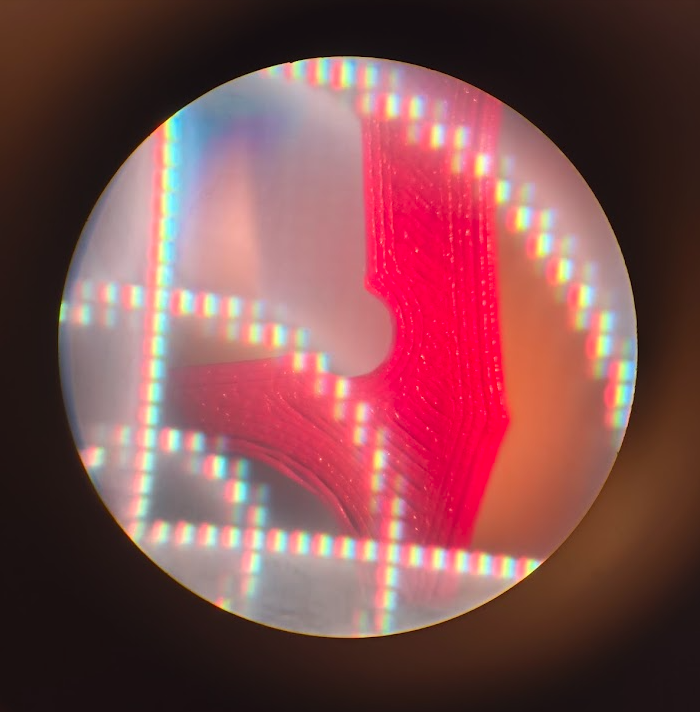
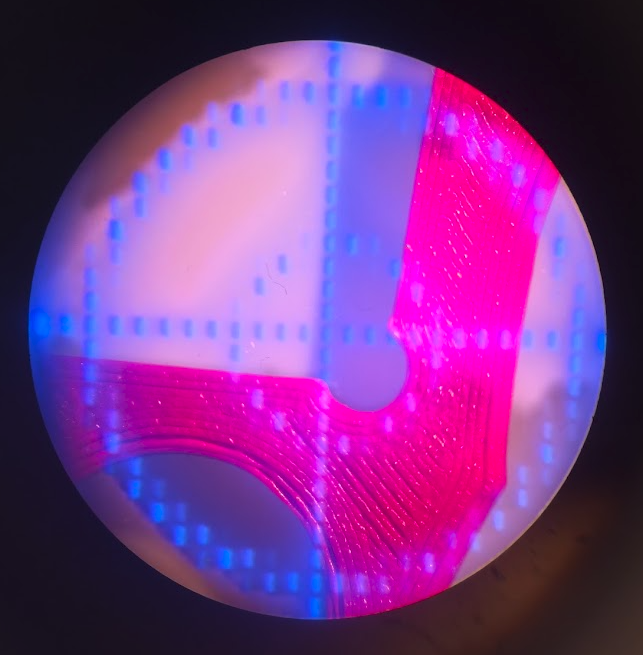

# Zeiss Stemi IVb microscope projects

Projects and documentation for a Zeiss Stemi IVb stereomicroscope from Zeiss West Germany, circa 1980.

## Stereo beamsplitter with OLED displays

This concept adds two OLED image channels to the Zeiss Stemi IVb. Each red end plate represents an OLED module. Red translucent geometry shows the OLED image path through the side arms and toward the microscope optics. Yellow translucent tubes show the microscope's viewing path. The mirror folds the OLED path into the viewing path, so the display image can be seen through the eyepieces alongside the specimen.

The CAD image is a concept visualization. It shows the optical paths and mechanical arrangement, but does not confirm final alignment, focus, clearances, or image quality.



[Open the Onshape model](https://cad.onshape.com/documents/6c9c3fd28f15d6c910aa045f/w/e978803368f50110e240ad08/e/2bc31ea5fd1c3efbace734eb?renderMode=0&uiState=6abaa6a0f70040a51ed1d5f2)

### Hand calculation, transcribed

The original whiteboard sketch records these calculation inputs.

| Item | Value from sketch | Notes |
| ---- | ---------------- | ----- |
| OLED image area | 20.14 × 13.42 | xyz pixels |
| Lens diameter | 26 | Marked `D26`; units milimeters |
| Lens focal length | 50 | Marked `F50` |
| Microscope eyepiece | W10/21 | Original eyepiece from microscope |
| OLED-to-lens and lens-to-mirror spacing | Not recorded | Both distances are marked with question marks |



The sketch suggests an OLED → lens → mirror → eyepiece optical path. Its missing distances can be measured in the CAD model and added here. For a first-order thin-lens estimate, record object distance `g`, image distance `b`, and focal length `f` from the lens principal plane:

```text
1/f = 1/g + 1/b
m = -b/g
```

Here, `m` is lateral magnification. These equations estimate the lens image only; they do not model the eyepiece, mirror alignment, aberrations, or the full binocular optical system. Add the measured distances and resulting calculations here once units and optical layout are confirmed.

### Digital calculation inputs to verify

- Confirm OLED active-area dimensions and units.
- Confirm lens diameter and focal length from lens marking or datasheet.
- Measure OLED-to-lens distance and identify the lens principal plane.
- Measure the folded optical path to mirror and eyepiece; record mirror angle and clear aperture.
- Check that the two OLED channels match the left and right eyepiece paths.
- Validate focus and image position with a physical prototype.

Do not treat the handwritten values as verified optical specifications until confirmed against the actual parts.

### Mono beamsplitter test

The microscope photo documents a physical test setup with a mono beamsplitter mounted below the binocular head. The two through-eyepiece images record views under red/orange and blue/magenta illumination. The illumination settings and exact test target are not documented.



| Through-eyepiece test image | View |
| ---- | ---- |
|  | White crosshairs |
|  | Blue crosshairs |

## Dark-field illuminator — under construction

[illuminator writeup.pdf](illuminator%20writeup.pdf) documents a dark-field illuminator built around a NeoPixel LED ring. The ring mounts around the microscope stage. A separate control box contains an Adafruit 5 V Pro Trinket, pushbuttons, and potentiometers for adjusting red, green, blue, and white LED brightness.

The writeup describes button debouncing with the Trinket's internal pull-ups and a 5 µF capacitor to ground. It also discusses a diffuser ring and possible future use of only part of the LED ring.

## Reference documentation

Three scanned Zeiss catalogs cover the Stemi IV and other stereomicroscope models. Use them as historical references for microscope configurations, accessories, and operation:

- [Zeiss Stereomikroskope I.pdf](Zeiss%20Stereomikroskope%20I.pdf)
- [Stereomikroskope II.pdf](Stereomikroskope%20II.pdf)
- [Stereomikroskope III.pdf](Stereomikroskope%20III.pdf)

## Dark-field illuminator

- `illuminator writeup.pdf` — design notes for the NeoPixel-based illuminator

This folder contains project documentation, scanned catalogs, and test images. It currently includes no firmware, bill of materials, or fabrication files.

## To do

- [ ] Complete optical calculations for the stereo beamsplitter.
- [ ] Update CAD model with verified dimensions.
- [ ] Complete the dark-field table project.
